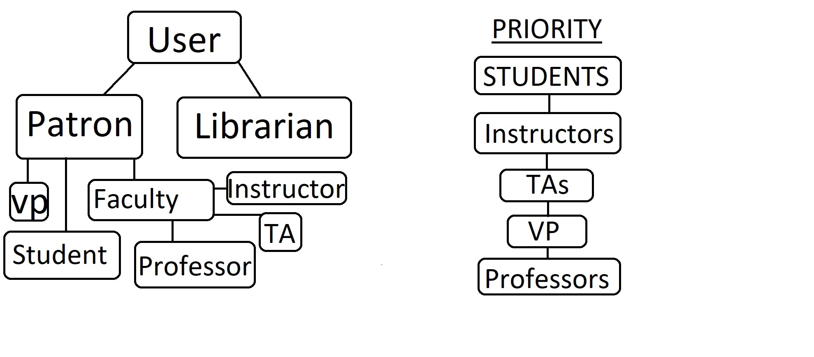

# KitapHana
---
Java-CSS-HTML-JavaScript implemetion of Library Management System webapp: 
Introduction to Programming project by students of BS1-6 group, team: Aygul Malikova, Almir Mullanurov,
Victoria Zubrinkina, Georgy Khorushevsky 
# Contents
  + <a href="#main">Main scheme</a>
  + <a href="#arc">Architecture of the website</a>
  + <a href="#imp">Implementation</a>
    + <a href="#doc">Documentation</a>
    + <a href="#user">Users</a>
    + <a href="#lib">Librarian features</a>
    + <a href="#book">Booking system</a>
  + <a href="#InstAndL">Usage</a>
    + <a href="#inst">Installation accompanying soft</a>
    + <a href="#launch">Launching the project</a>
    + <a href="#issue">Issues?</a>
    + <a href="#entry">Entrying</a>
  + <a href="#test">Testing</a>
  + <a href="#soft">Soft in use</a>
<a name="main">

# Main scheme
</a>
Patrons are able survey diffrent documents on the main page and check them out for a certain time.
Librarins are used to manage their moves and them as objects. 
<a name="arc"> 
   
# Architecture of the website
</a> 
  
<a name="imp">
   
# Implementation
</a>
<a name="doc">
   
## Documents
</a>
We store all documents in documents db. 

         public class Document {
             protected String title;
             protected String keywords;
             protected String authors;
             protected String cover;
             protected String type;
             protected int price, amount, id;

which is typicly the abstract class for all documents.
Below we have particular types of document extending from it: 

         public class Book extends Document {
             protected String publisher;
             protected int year, edition_number;
             protected int best_seller;

 

         public class AVMaterial extends Document {

 

         public class JournalArticle extends Document{
             protected String journal_name, date;
             protected ArrayList<String> editors;
<a name="user">
   
## Users
</a>

  + Patron 
   *Could give requests to  ***search for, check out and return documents***.*
    + Student
   *Have permission to сheck out documents for ***3*** weeks* 
    + Faculty member 
   *Have permission to сheck out documents for ***4*** weeks* 
  + Librarian
   *Is allowed to ***modify/delete/add*** any document or patron.*

We assign the loged in user with new exemplar of appropriate class:

         public class User {
             protected String phone_number, name, surname, password, possible_type, type, email;
             protected Address address;
             protected long card_number, maxdays, day = 24*60*60*1000;
             protected int id;
             protected ArrayList<Document> documents;
             protected ArrayList<Long> deadlines;
<a name="lib">

## Librarian features
</a>
Librarian is a user with manage abilities. One's 3special features
defined in class Librarian. 

         public void modifyDocument(Document document) throws SQLException {...
         public void  removeDocument(Document document) throws SQLException {...
         public void addDocument() throws SQLException {...
         public void modifyUser(User user) throws SQLException {...
         public void removeUser(User user) throws SQLException {...

<a name="book">

## Booking System (Document Copy)
</a>

         public void checkOutDocument(Document document) throws SQLException {
                 if(document.getAmount() > 0 && !this.hasDocument(document)){
                     addDocument(document);
                     document.decreaseAmount();
                     document.addUser(this);
                     document.save();
                     save();
                 }
                 else{
                     System.out.println("You can't book this document");
                 }
             }

Every time user check out document - mount of copies in the library decrease.
<a name="InstAndL">
  
# Usage
</a>
<a name="inst">

## Installation accompanying soft:
</a>

#### Install Java jdk according to your operation system

  + use <a href="ProvidedDoc/java.pdf"> This guide </a>

#### Install Intellij IDEA 
  + use <a href="https://www.jetbrains.com/help/idea/install-and-set-up-intellij-idea.html"> This guide</a> 
#### Install mySql

  + use <a href="ProvidedDoc/mysql.pdf">This guide</a>
<a name="launch"> 
   
## Launching the project
</a>

#### Download and launch the project
  
  + use <a href="ProvidedDoc/project.pdf">This guide</a>
<a name="issue">
   
## Issues?
</a>

### If something goes wrong:
  + Deinstall everything and try again
  + Still have some problems? Please contact one of us in Telegram:
    + Almir Mullanurov - @mir_lan
    + Georgy Khorushevsky - @georrgy
    + Aygul Malikova - @Aygul_Malikova
    + Victoria Zubrinkina - @foolonparade
<a name="entry">

## Entrying
</a>
To expect the library one can use one of pre-signed up users:
<ul>
   <li> Patron:
      <ul>
         <li> login - 93700371002
         <li> password - 123
      </ul>
   <li> Librarian:
      <ul>
         <li> login - 89547456654
         <li> password  - 123
     </ul>
or simply provide registration
<a name="test">
 
# Testing:
</a>
  + Go to com/kitaphana/algorithms
  + choose appropriate number of test
  + Run it
<a name="soft">

# Soft in use:
</a>

  + <a href="http://maven.apache.org/POM/4.0.0">Maven</a>
  + <a href="https://www.mysql.com/">MySQL</a>
  + <a href="https://www.jetbrains.com/idea/">Intellij IDEA</a>
  + <a href="http://www.oracle.com/technetwork/java/javase/downloads/index.html">Java JDK</a>
